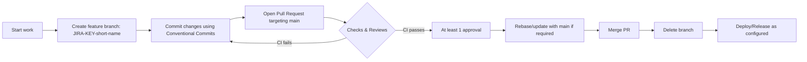
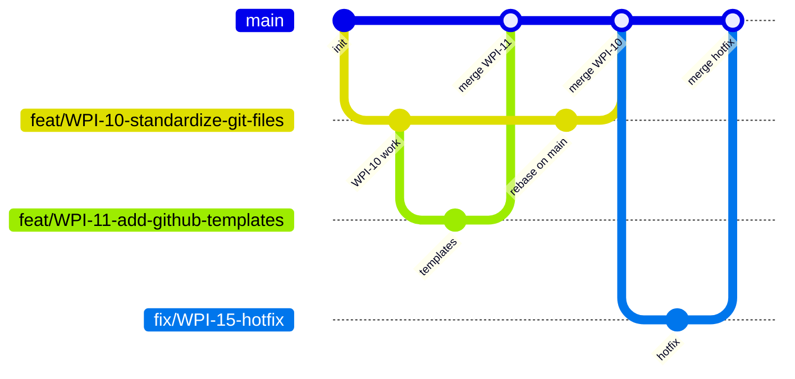

# Contributing to wpi-stratify

This guide documents the repository conventions for the project. Please read it before opening a PR.

Related: Confluence page “WPI-14: Repository Conventions”.

## Branching Strategy
We follow GitHub Flow.

- main is protected (no direct pushes)
- Use feature branches for all work
- Naming: `JIRA-KEY-short-description` (e.g., `WPI-14-document-repo-conventions`)
- Create from main and keep up to date via rebase:

```bash
git pull --rebase origin main
```

## Commit Messages (Conventional Commits)

Format: `<type>(<scope>): <subject>`

- type: feat | fix | docs | style | refactor | test | chore
- scope: optional (e.g., backend, frontend, auth)
- subject: imperative summary

Example:

```text
feat(auth): implement user login endpoint
```

## Pull Requests

- Use the PR template
- Require at least 1 approval
- Require passing checks and up-to-date with main

## Labels

Use labels to categorize work (initial set):

- bug, feature, documentation, backend, frontend

## Jira Components

- backend, frontend, devops

## Workflow Overview (diagram)



## Timeline Example (diagram)


